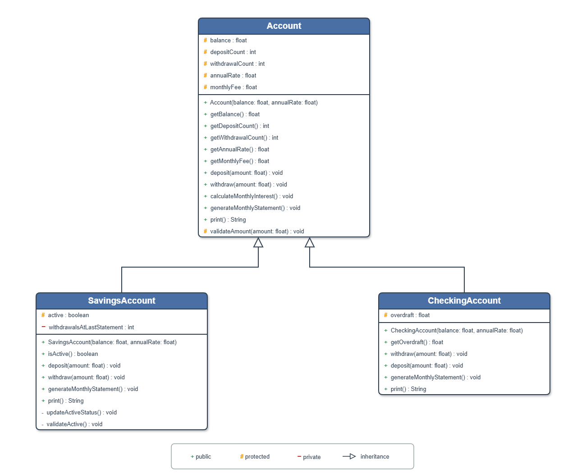
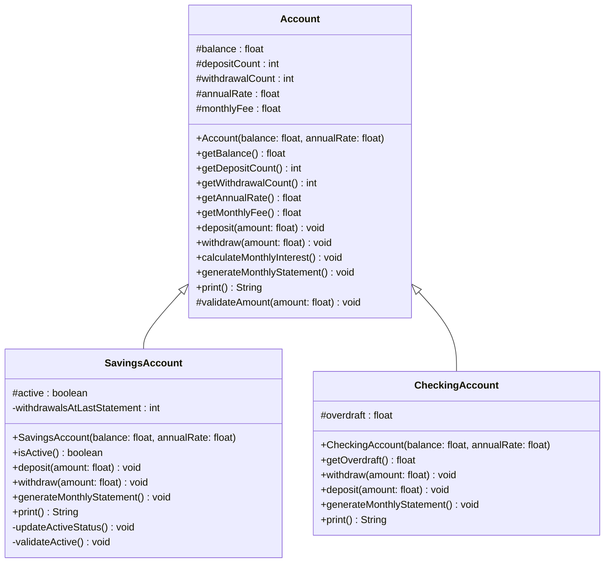
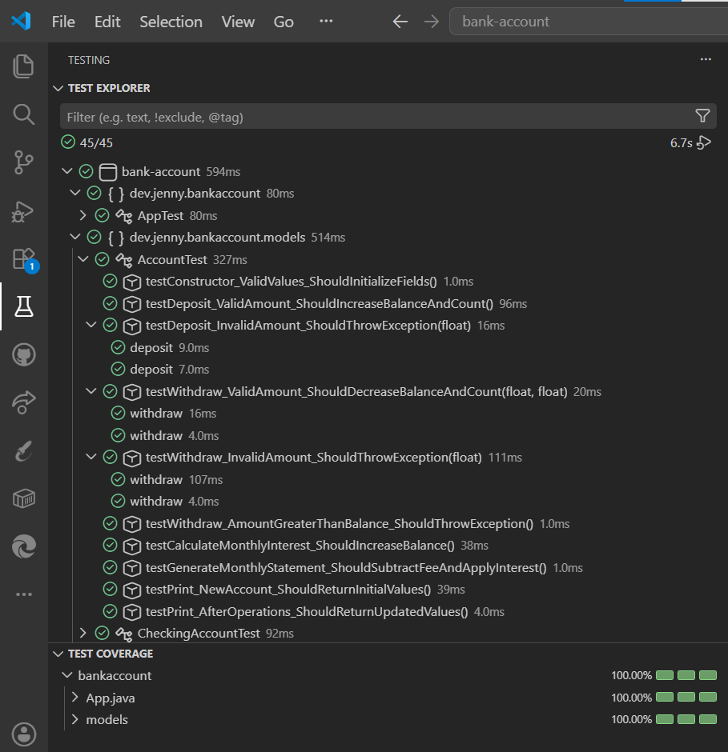
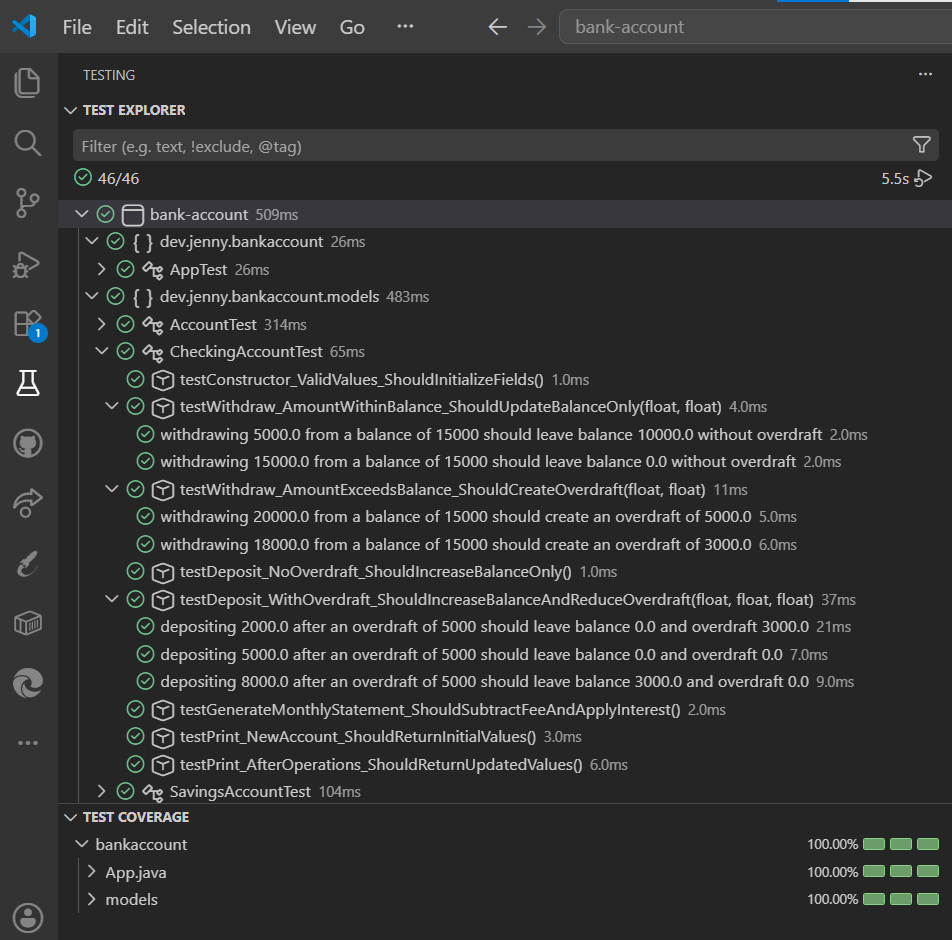
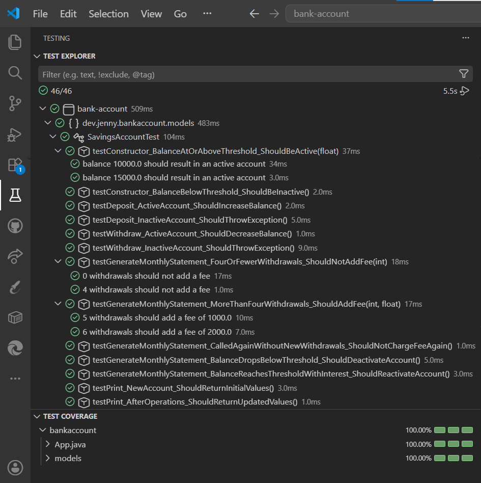
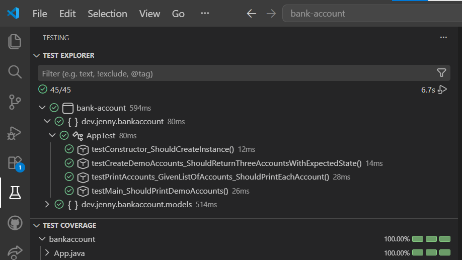
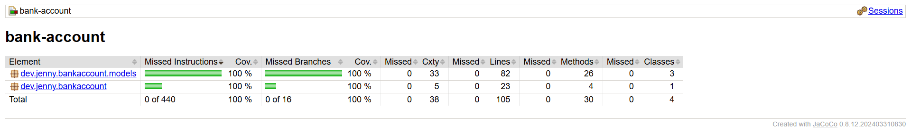

# 🏦 Cuenta Bancaria en Java

> En esta cuenta bancaria, la herencia no llega con el testamento, llega con `extends`

Proyecto en **Java 21** con **Maven** que modela una cuenta bancaria genérica y dos variantes con comportamiento propio, cuenta de ahorros y cuenta corriente, mediante herencia y polimorfismo. Desarrollado siguiendo **TDD** (JUnit 5 + Hamcrest), con cobertura de tests medida con **JaCoCo**.

---

## 📑 Índice

- [Descripción](#-descripción)
- [Diagrama de clase](#-diagrama-de-clase)
- [Cómo reproducir el proyecto](#-cómo-reproducir-el-proyecto)
- [Estructura del repositorio](#-estructura-del-repositorio)
- [Testing](#-testing)
- [Cobertura de tests](#-cobertura-de-tests-coverage)
- [Tecnologías](#-tecnologías)
- [Recursos](#-recursos)
- [Autora](#-autora)

---

## 📋 Descripción

**Cuenta Bancaria** es un proyecto de Programación Orientada a Objetos (**POO**) que simula la gestión básica de una entidad financiera: `Account` es la clase padre, y `CheckingAccount` y `SavingsAccount` son sus clases hijas que heredan de ella el comportamiento común (consignar, retirar, calcular el interés, generar el extracto), reutilizando ese código y añadiendo solo la regla propia de cada tipo de cuenta.

La separación de responsabilidades se resuelve a nivel de clase, no de capas: cada modelo (`Account` y sus hijas) contiene toda su propia lógica de negocio y devuelve `String` en vez de imprimir, y `App` es la única clase que escribe en consola. Según el enunciado que tenemos, esto no es una aplicación con una fuente de datos externa (una base de datos, una API) que justifique separar Controller/Service/Repository ni aplicar MVC, así que no considero que esa arquitectura aplique aquí, y por eso lo he desarrollado de esta manera:

### Clase padre: Cuenta (`Account`)

**Atributos protegidos:**

- `balance` (float)
- `depositCount` (int, inicial 0)
- `withdrawalCount` (int, inicial 0)
- `annualRate` (float)
- `monthlyFee` (float, inicial 0)

**Constructor:**

Inicializa `balance` y `annualRate` a partir de los parámetros recibidos

**Métodos:**

- `deposit(amount)`: aumenta el saldo
- `withdraw(amount)`: reduce el saldo, sin permitir superar el saldo disponible
- `calculateMonthlyInterest()`: aplica el interés mensual derivado de la tasa anual
- `generateMonthlyStatement()`: resta la comisión mensual y calcula el interés (invocando a `calculateMonthlyInterest()`)
- `print()`: devuelve los valores de todos los atributos

### Clase hija: Cuenta de ahorros (`SavingsAccount`)

**Atributos propios:**

- `active` (boolean) — la cuenta se activa/desactiva automáticamente según si el saldo supera los $10.000
- `withdrawalsAtLastStatement` (int, privado) — guarda cuántos retiros había en el extracto anterior, para calcular la comisión solo sobre los retiros nuevos

**Métodos redefinidos:**

- `deposit` / `withdraw`: solo se ejecutan si la cuenta está activa, invocando al método heredado
- `generateMonthlyStatement()`: cobra $1.000 de comisión por cada retiro por encima de 4 desde el último extracto, y reevalúa si la cuenta sigue activa
- `print()` (redefinido): saldo, comisión mensual y número total de transacciones (consignaciones + retiros)

### Clase hija: Cuenta corriente (`CheckingAccount`)

**Atributo propio:**

- `overdraft` (float, inicial 0)

**Métodos redefinidos:**

- `withdraw`: permite retirar más saldo del disponible; el excedente queda como sobregiro
- `deposit`: aplica la cantidad consignada primero a cancelar el sobregiro pendiente; solo el sobrante aumenta el saldo
- `generateMonthlyStatement()`: invoca al método heredado sin lógica adicional
- `print()` (redefinido): saldo, comisión mensual, transacciones totales y sobregiro

El enunciado no concretaba del todo estos dos comportamientos, así que estas fueron las decisiones que tomé:

- `CheckingAccount.deposit()`: cuando hay sobregiro, la cantidad consignada se aplica primero a cancelarlo, y solo lo que sobra aumenta el saldo, para que un depósito no genere saldo de la nada
- `SavingsAccount.generateMonthlyStatement()`: la comisión por exceso de retiros se calcula sobre los retiros desde el último extracto, no sobre el total histórico de la cuenta, para que un mismo retiro no se cobre dos veces

<details>
<summary><strong>Enunciado completo</strong></summary>

Desarrollar un programa que modele una cuenta bancaria que tiene los siguientes atributos, que deben ser de acceso protegido:

- Saldo, de tipo float.
- Número de consignaciones con valor inicial cero, de tipo int.
- Número de retiros con valor inicial cero, de tipo int.
- Tasa anual (porcentaje), de tipo float.
- Comisión mensual con valor inicial cero, de tipo float.

La clase Cuenta tiene un constructor que inicializa los atributos saldo y tasa anual con valores pasados como parámetros. La clase Cuenta tiene los siguientes métodos:

- Consignar una cantidad de dinero en la cuenta actualizando su saldo.
- Retirar una cantidad de dinero en la cuenta actualizando su saldo. El valor a retirar no debe superar el saldo.
- Calcular el interés mensual de la cuenta y actualiza el saldo correspondiente.
- Extracto mensual: actualiza el saldo restándole la comisión mensual y calculando el interés mensual correspondiente (invoca el método anterior).
- Imprimir: retorno los valores de los atributos.

La clase Cuenta tiene dos clases hijas:

**Cuenta de ahorros:** posee un atributo para determinar si la cuenta de ahorros está activa (tipo boolean). Si el saldo es menor a $10000, la cuenta está inactiva, en caso contrario se considera activa. Los siguientes métodos se redefinen:

- Consignar: se puede consignar dinero si la cuenta está activa. Debe invocar al método heredado.
- Retirar: es posible retirar dinero si la cuenta está activa. Debe invocar al método heredado.
- Extracto mensual: si el número de retiros es mayor que 4, por cada retiro adicional, se cobra $1000 como comisión mensual. Al generar el extracto, se determina si la cuenta está activa o no con el saldo.
- Un nuevo método imprimir que retorna el saldo de la cuenta, la comisión mensual y el número de transacciones realizadas (suma de cantidad de consignaciones y retiros).

**Cuenta corriente:** posee un atributo de sobregiro, el cual se inicializa en cero. Se redefinen los siguientes métodos:

- Retirar: se retira dinero de la cuenta actualizando su saldo. Se puede retirar dinero superior al saldo. El dinero que se debe queda como sobregiro.
- Consignar: invoca al método heredado. Si hay sobregiro, la cantidad consignada reduce el sobregiro.
- Extracto mensual: invoca al método heredado.
- Un nuevo método imprimir que retorna el saldo de la cuenta, la comisión mensual, el número de transacciones realizadas (suma de cantidad de consignaciones y retiros) y el valor de sobregiro.

**Requisitos:**

- Diagrama UML de clases
- Tests unitarios obligatorios (cobertura mínima 70%)

**Entregables:**

- Repositorio de Github
- Captura de pantalla del diagrama de clase o enlace público al archivo
- Captura de pantalla de la sección testing de VSCode que muestre que se ha cumplido con la cobertura de tests

</details>

---

## 📐 Diagrama de clase

`Account` es la clase padre y expone la lógica común (consignar, retirar, calcular el interés, generar el extracto e imprimir), además del método protegido `validateAmount()` que reutilizan las dos clases hijas.

`SavingsAccount` añade el atributo `active` y el privado `withdrawalsAtLastStatement`, con sus propios métodos privados de apoyo (`updateActiveStatus()`, `validateActive()`).

`CheckingAccount` añade el atributo `overdraft` y redefine `withdraw()`, `deposit()` y `print()` para reflejarlo.



<details>
<summary>Ver versión en Mermaid</summary>



</details>

---

## 🚀 Cómo reproducir el proyecto

### Requisitos previos

| Herramienta                                                   | Requisito                  | Guía de instalación                                                                                       |
| ------------------------------------------------------------- | -------------------------- | --------------------------------------------------------------------------------------------------------- |
| [JDK 21](https://www.oracle.com/java/technologies/downloads/) | Instalado y en el `PATH`   | [Ver guía](https://docs.oracle.com/en/java/javase/21/install/overview-jdk-installation.html)              |
| [Apache Maven](https://maven.apache.org/download.cgi)         | Instalado y en el `PATH`   | [Ver guía](https://maven.apache.org/install.html)                                                         |
| [Git](https://git-scm.com/downloads)                          | Para clonar el repositorio | [Ver guía](https://git-scm.com/book/es/v2/Inicio---Sobre-el-Control-de-Versiones-Instalaci%C3%B3n-de-Git) |

### Pasos

**1. Comprueba que tienes Java y Maven instalados** (si algún comando no se reconoce, instálalo desde los enlaces de _Requisitos previos_):

```bash
java --version
mvn --version
```

**2. Clona el repositorio:**

```bash
git clone https://github.com/Jennydev-25/bank-account.git
```

**3. Entra en la carpeta del proyecto:**

```bash
cd bank-account
```

**4. Ejecuta los tests** (compila y genera el reporte de cobertura de JaCoCo):

```bash
mvn test
```

El reporte de cobertura se genera en `target/site/jacoco/index.html`, que puedes abrir en el navegador.

**5. Ejecuta la aplicación** e imprime las tres cuentas demo por consola:

```bash
mvn exec:java
```

---

## 📁 Estructura del repositorio

```text
bank-account/
├── assets/
│   └── images/
│       ├── coverage/
│       │   └── coverage-jacoco.png
│       ├── diagram/
│       │   └── class-diagram-uml.png
│       └── test-explorer/
│           ├── test-explorer-account.png
│           ├── test-explorer-app.png
│           ├── test-explorer-checking-account.png
│           └── test-explorer-savings-account.png
├── src/
│   ├── main/java/dev/jenny/bankaccount/
│   │   ├── App.java
│   │   └── models/
│   │       ├── Account.java
│   │       ├── CheckingAccount.java
│   │       └── SavingsAccount.java
│   └── test/java/dev/jenny/bankaccount/
│       ├── AppTest.java
│       └── models/
│           ├── AccountTest.java
│           ├── CheckingAccountTest.java
│           └── SavingsAccountTest.java
├── .gitignore
├── pom.xml
└── README.md
```

---

## 🧪 Testing

Siguiendo la metodología **TDD**, cada clase se testea cubriendo todos sus escenarios con **JUnit 5 + Hamcrest**:

### `AccountTest`

Cubre los métodos que el enunciado pide para la clase padre: consignar, retirar sin superar el saldo, calcular el interés mensual, generar el extracto y devolver los valores de los atributos. Estos mismos métodos se heredan y reutilizan en las dos cuentas hijas.



| Test                                                             | Escenario                                                      |
| ---------------------------------------------------------------- | -------------------------------------------------------------- |
| `testConstructor_ValidValues_ShouldInitializeFields`             | Inicializa los atributos con los valores recibidos             |
| `testDeposit_ValidAmount_ShouldIncreaseBalanceAndCount`          | Aumenta el saldo y el contador de consignaciones               |
| `testDeposit_InvalidAmount_ShouldThrowException`                 | Lanza excepción si la cantidad a consignar no es válida        |
| `testWithdraw_ValidAmount_ShouldDecreaseBalanceAndCount`         | Reduce el saldo y aumenta el contador de retiros               |
| `testWithdraw_InvalidAmount_ShouldThrowException`                | Lanza excepción si la cantidad a retirar no es válida          |
| `testWithdraw_AmountGreaterThanBalance_ShouldThrowException`     | Lanza excepción si se intenta retirar más saldo del disponible |
| `testCalculateMonthlyInterest_ShouldIncreaseBalance`             | Aumenta el saldo aplicando el interés mensual                  |
| `testGenerateMonthlyStatement_ShouldSubtractFeeAndApplyInterest` | Resta la comisión mensual y aplica el interés                  |
| `testPrint_NewAccount_ShouldReturnInitialValues`                 | Devuelve los valores iniciales de una cuenta nueva             |
| `testPrint_AfterOperations_ShouldReturnUpdatedValues`            | Devuelve los valores actualizados tras varias operaciones      |

### `CheckingAccountTest`

Cubre el comportamiento propio de la cuenta corriente que pide el enunciado: retirar por encima del saldo generando sobregiro, y consignar reduciendo ese sobregiro antes de aumentar el saldo. También verifica el nuevo `print()` con el valor del sobregiro incluido.



| Test                                                                | Escenario                                                                            |
| ------------------------------------------------------------------- | ------------------------------------------------------------------------------------ |
| `testConstructor_ValidValues_ShouldInitializeFields`                | Inicializa los atributos, incluido el sobregiro a 0                                  |
| `testWithdraw_AmountWithinBalance_ShouldUpdateBalanceOnly`          | Retira dentro del saldo disponible, sin generar sobregiro                            |
| `testWithdraw_AmountExceedsBalance_ShouldCreateOverdraft`           | Retira más saldo del disponible y genera sobregiro                                   |
| `testDeposit_NoOverdraft_ShouldIncreaseBalanceOnly`                 | Consigna sin sobregiro pendiente, aumentando solo el saldo                           |
| `testDeposit_WithOverdraft_ShouldIncreaseBalanceAndReduceOverdraft` | Consigna con sobregiro pendiente: primero lo cancela, y el sobrante aumenta el saldo |
| `testGenerateMonthlyStatement_ShouldSubtractFeeAndApplyInterest`    | Invoca al método heredado sin lógica adicional                                       |
| `testPrint_NewAccount_ShouldReturnInitialValues`                    | Devuelve los valores iniciales de una cuenta nueva                                   |
| `testPrint_AfterOperations_ShouldReturnUpdatedValues`               | Devuelve los valores actualizados, incluido el sobregiro                             |

### `SavingsAccountTest`

Cubre el comportamiento propio de la cuenta de ahorros que pide el enunciado: activarse o desactivarse según el saldo, permitir consignar y retirar solo si está activa, y cobrar comisión por cada retiro por encima de 4 en el extracto mensual. También verifica el nuevo `print()` con el total de transacciones.



| Test                                                                                       | Escenario                                                                          |
| ------------------------------------------------------------------------------------------ | ---------------------------------------------------------------------------------- |
| `testConstructor_BalanceAtOrAboveThreshold_ShouldBeActive`                                 | Se crea activa si el saldo alcanza los $10.000                                     |
| `testConstructor_BalanceBelowThreshold_ShouldBeInactive`                                   | Se crea inactiva si el saldo no llega a $10.000                                    |
| `testDeposit_ActiveAccount_ShouldIncreaseBalance`                                          | Consigna si la cuenta está activa                                                  |
| `testDeposit_InactiveAccount_ShouldThrowException`                                         | Lanza excepción si se consigna con la cuenta inactiva                              |
| `testWithdraw_ActiveAccount_ShouldDecreaseBalance`                                         | Retira si la cuenta está activa                                                    |
| `testWithdraw_InactiveAccount_ShouldThrowException`                                        | Lanza excepción si se retira con la cuenta inactiva                                |
| `testGenerateMonthlyStatement_FourOrFewerWithdrawals_ShouldNotAddFee`                      | No cobra comisión con 4 retiros o menos desde el último extracto                   |
| `testGenerateMonthlyStatement_MoreThanFourWithdrawals_ShouldAddFee`                        | Cobra comisión por cada retiro por encima de 4 desde el último extracto            |
| `testGenerateMonthlyStatement_CalledAgainWithoutNewWithdrawals_ShouldNotChargeFeeAgain`    | No vuelve a cobrar la comisión si no hay retiros nuevos desde el extracto anterior |
| `testGenerateMonthlyStatement_BalanceDropsBelowThreshold_ShouldDeactivateAccount`          | Desactiva la cuenta si el saldo cae por debajo de $10.000                          |
| `testGenerateMonthlyStatement_BalanceReachesThresholdWithInterest_ShouldReactivateAccount` | Reactiva la cuenta si el saldo alcanza $10.000 tras aplicar el interés             |
| `testPrint_NewAccount_ShouldReturnInitialValues`                                           | Devuelve los valores iniciales de una cuenta nueva                                 |
| `testPrint_AfterOperations_ShouldReturnUpdatedValues`                                      | Devuelve los valores actualizados tras varias operaciones                          |

### `AppTest`

Cubre la clase de presentación, encargada de crear las tres cuentas de ejemplo y mostrarlas por consola. No forma parte de la lógica de negocio que pide el enunciado, pero se testea igualmente para mantener el coverage exigido.



| Test                                                                | Escenario                                          |
| ------------------------------------------------------------------- | -------------------------------------------------- |
| `testConstructor_ShouldCreateInstance`                              | Crea una instancia de `App`                        |
| `testCreateDemoAccounts_ShouldReturnThreeAccountsWithExpectedState` | Devuelve las 3 cuentas demo con el estado esperado |
| `testPrintAccounts_GivenListOfAccounts_ShouldPrintEachAccount`      | Imprime cada cuenta de la lista por consola        |
| `testMain_ShouldPrintDemoAccounts`                                  | Ejecuta `main` e imprime las cuentas demo          |

---

## 📊 Cobertura de tests (coverage)

Reporte generado con **JaCoCo** tras ejecutar `mvn test`. El informe HTML se encuentra en `target/site/jacoco/index.html`



| Métrica       | Cobertura |
| ------------- | --------- |
| Instrucciones | 100 %     |
| Ramas         | 100 %     |
| Líneas        | 100 %     |
| Métodos       | 100 %     |

---

## 🛠️ Tecnologías

- **[Java 21](https://www.oracle.com/java/technologies/downloads/)** — Lenguaje de programación del proyecto
- **[Apache Maven](https://maven.apache.org/)** — Gestor de dependencias y construcción del proyecto
- **[JUnit 5](https://junit.org/junit5/)** — Framework de tests unitarios
- **[Hamcrest](https://hamcrest.org/JavaHamcrest/)** — Librería de matchers para aserciones legibles
- **[JaCoCo](https://www.jacoco.org/jacoco/)** — Medición de la cobertura de tests
- **[Visual Studio Code](https://code.visualstudio.com/)** — Editor usado para desarrollar y gestionar el proyecto
- **[Markdown](https://www.markdownguide.org/)** — Lenguaje de marcado para el README
- **[Git](https://git-scm.com/)** / **[GitHub](https://github.com/)** — Control de versiones y alojamiento del proyecto

---

## 📚 Recursos

- **[The Java Tutorials — Controlling Access to Members of a Class](https://docs.oracle.com/javase/tutorial/java/javaOO/accesscontrol.html)** — Documentación oficial de `protected` y el resto de modificadores de acceso
- **[The Java Tutorials — Annotations](https://docs.oracle.com/javase/tutorial/java/annotations/)** — Documentación oficial de anotaciones (`@Override`, `@Test`...)
- **[The Java Tutorials — Interfaces and Inheritance](https://docs.oracle.com/javase/tutorial/java/IandI/subclasses.html)** — Documentación oficial de herencia y polimorfismo en Java
- **[JUnit 5 User Guide](https://junit.org/junit5/docs/current/user-guide/)** — Documentación oficial de JUnit 5
- **[Hamcrest – JavaHamcrest](https://hamcrest.org/JavaHamcrest/)** — Documentación de los matchers de Hamcrest
- **[JaCoCo Maven Plugin](https://www.jacoco.org/jacoco/trunk/doc/maven.html)** — Documentación del plugin de cobertura
- **[Exec Maven Plugin](https://www.mojohaus.org/exec-maven-plugin/usage.html)** — Documentación del plugin usado para ejecutar la aplicación con `mvn exec:java`
- **[Mermaid – Class Diagrams](https://mermaid.js.org/syntax/classDiagram.html)** — Documentación de Mermaid para diagramas de clase

---

## 👩‍💻 Autora

**[Jenny Sánchez Requejo](https://github.com/Jennydev-25)**

[Volver arriba](#-cuenta-bancaria-en-java)
